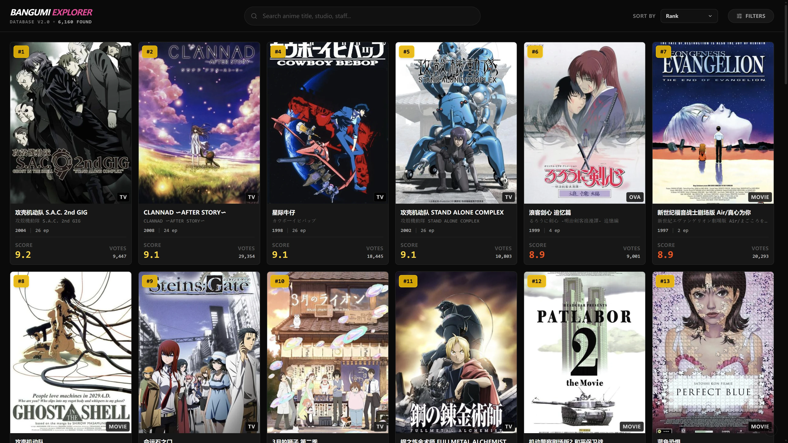
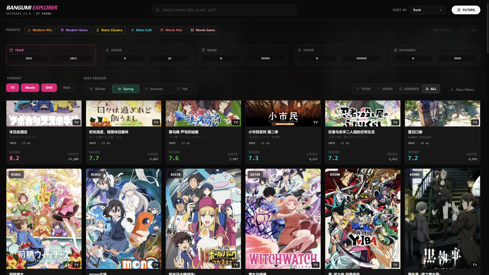
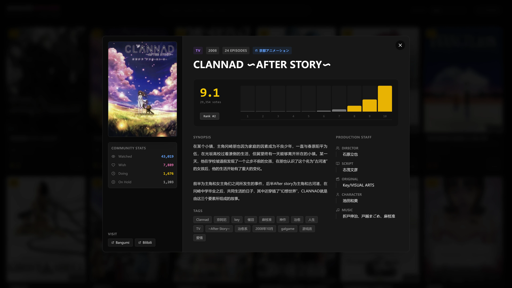

  
  <h1>Bangumi Explorer</h1>
  
<strong>A minimalist, modern anime discovery and collection manager.</strong>

  

    
    
  

  

    <b>English</b> | <a href="./README_CN.md">中文说明</a>
  

 

  
  
  

---

## 📖 Background: From Excel to Explorer

As a dedicated anime collector, my local **Emby** library houses over **1,000 titles**. As the collection grew, maintaining this massive library became a challenge—not just managing what I *had*, but identifying what I was *missing*.

My early workflow was primitive: Python scripts processing scraped Bangumi data, dumped into Excel after cleaning. While Excel's filtering is powerful, staring at thousands of rows of cold text offered no joy in browsing the art form. Furthermore, manually cross-referencing local inventory with online databases was a tedious, soul-crushing process.

**Bangumi Explorer** was born from this need. I wanted to make the process elegant, intuitive, and efficient. It is not just a database; it is a private **"Curator's Gallery"** for anime.

Visit the live site: [bangumi-explorer.neutrinoy.xyz](https://bangumi-explorer.neutrinoy.xyz)

---

## ✨ Core Features

### 1. A Modern Bangumi Experience (For Guests)
Even without the collection features, this project serves as a **blazing fast, third-party frontend for Bangumi**.
*   **Instant Interaction**: Built on Next.js, leveraging localized indexing for near-zero latency search and filtering—far faster than traditional page loads.
*   **Visual-First**: Immersive dark mode and card-based design focus on posters and key metrics (Score, Rank, Year), eliminating redundant noise.
*   **Responsive**: Meticulously designed layout that delivers a silky-smooth experience on everything from 4K desktop monitors to mobile screens.

### 2. Visual Gap Analysis
This project transforms dry data comparison into a visual language. Through color-coded badges, I can instantly scan a specific year or genre and spot the "holes" in my collection map, allowing for rapid gap analysis.
*   **Status Badges**:
    *   🟢 **Collected**: Synced with Emby/Local library.
    *   🔵 **Wishlist**: Potential targets for future acquisition.
    *   🔴 **Ignored**: Confirmed as not interested.
    *   ⚪ **Todo**: Unassessed entries.

### 3. Multi-Dimensional Lens
To satisfy diverse curation needs, I implemented an advanced filtering system beyond simple search, featuring **6 Logic Presets** and **Fine-grained Controls**:

*   **⚡ Smart Presets**:
    *   **🔥 Modern Hits / 🎬 Movie Hits**: Quickly locate high-popularity blockbusters.
    *   **💎 Modern Gems / 🎬 Movie Gems**: Filter for "High Score, Low Vote Count" titles—unearthing hidden masterpieces.
    *   **⏳ Retro Classics / ⚡ Retro Cult**: One-click focus on Golden Age (pre-2005) standards and cult classics.
*   **📏 Scope Control**:
    *   **Max 52 Eps**: Filter out long-running franchises to focus on concise narratives.
    *   **> 1 Ep**: Filter out single-episode OVAs/Movies to focus on series.
*   **📅 Seasonal Index**: When a specific year (e.g., 2025) is locked, a **Seasonal Selector** (Winter/Spring/Summer/Fall) automatically appears for precise quarterly tracking.

### 4. Backend Architecture
*   **Supabase Backend**: Uses Supabase (PostgreSQL) to store collection status, enforced by RLS (Row Level Security) policies.
*   **Dual Access**:
    *   **Guest Mode**: Publicly readable, sharing my personal taste and collection list.
    *   **Admin Mode**: Password-protected write access to ensure data integrity.

---

## 🔄 Data Pipeline & ETL (Automated)

The data foundation of this project is derived from the open-source project [Jinrxin/bangumi-data](https://github.com/Jinrxin/bangumi-data). Special thanks to the author for the crawler work that provides the comprehensive Bangumi dataset.

**Fully Automated via GitHub Actions:**
The system is now completely self-sustaining:
1.  **Daily Sync**: Automatically checks the upstream repository for updates every day (UTC 0:00).
2.  **Internal ETL**: Triggers the `merge.cjs` script to Extract, Transform, and Load the raw data.
3.  **Auto Deploy**: Commits the fresh `db.json` to the repo, triggering a Vercel rebuild automatically.

Data remains "fresh" without any manual intervention.

---

## 🛠️ Tech Stack

Built on the latest generation of the Web ecosystem, pursuing extreme performance and developer experience.

*   **Frontend**: [Next.js 16](https://nextjs.org/) (App Router), [React](https://react.dev/), [TypeScript](https://www.typescriptlang.org/)
*   **Styling**: [Tailwind CSS](https://tailwindcss.com/), [Framer Motion](https://www.framer.com/motion/)
*   **Backend / Auth**: [Supabase](https://supabase.com/)
*   **Icons**: [Lucide React](https://lucide.dev/)

---

> *"Data is just noise until you give it structure and soul."*